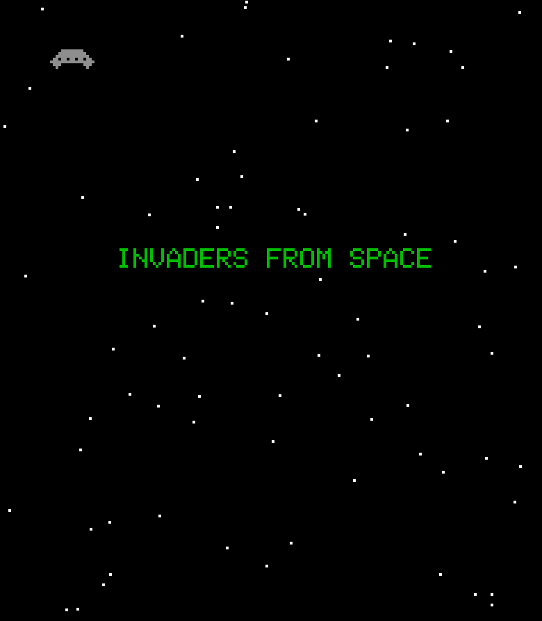

## Invaders from Space

<p align="center" width="100%">
   
</p>


Invaders from Space is a twist on a classic arcade game reimagined for the web. Developed using TypeScript, HTML, and CSS, this game brings the nostalgic alien-shooting experience to your browser. Players control the defender, dodging invader attacks while trying to save the world.

Features:

- Smooth animation and gameplay
- Score tracking and high-score board
- Sound effects

<!-- GETTING STARTED -->

## Getting Started

Must have Node and Npm installed.

### Installation

1. Clone the repo
   ```sh
   git clone https://github.com/seewilds/invadersFromSpace.git
   ```
2. Install NPM packages
   ```sh
   npm install
   ```
3. Run Start
   ```sh
   npm start
   ```

<!-- LICENSE -->

## License

Distributed under the MIT License. See `LICENSE.txt` for more information.

<!-- CONTACT -->

## Contact

Project Link: [https://github.com/seewilds/invadersFromSpace](https://github.com/seewilds/invadersFromSpace)
